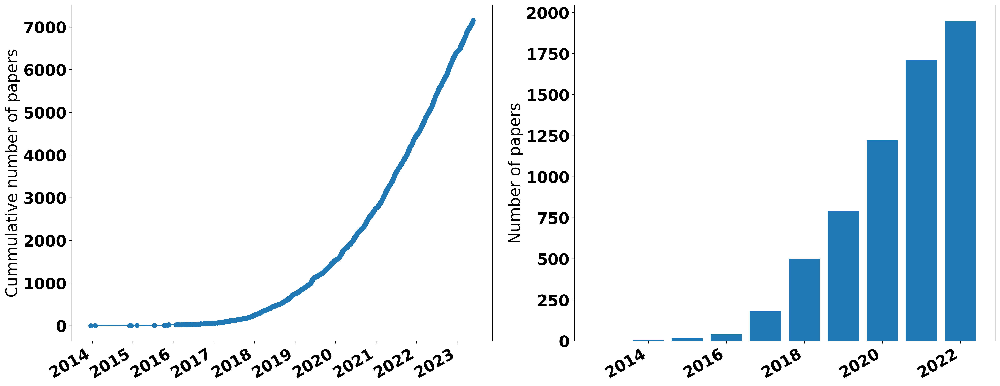

# AML-Leaders

## Disclaimer 
The following is a compilation of research groups and notable researchers in the field of Adversarial Machine Learning that I personally follow and find intriguing. It is important to note that this list is by no means exhaustive, nor is it intended to serve as a definitive ranking. Its purpose was to provide a curated selection of resources for reference or exploration (I was searching for an internship :). Therefore, please be gentle with me, any suggestions are welcome.


## Groups or leaders and their useful resources 

The Table below can be found in `AML-People-Group.csv` and is generated by the command 

```bash

python gentable.py

```


|Name |Affilation |Resources | 
|----|----------|---------| 
|[Nicholas Carlini](https://nicholas.carlini.com) |Google, UC Berkeley |[C&W Attacks, How to evaluate Adversarial Robustness](https://arxiv.org/abs/1902.06705)<br> [A Complete List of All Adversarial Example Papers](https://nicholas.carlini.com/writing/2019/all-adversarial-example-papers.html)<br> [Adversarial Machine Learning Reading List](https://nicholas.carlini.com/writing/2018/adversarial-machine-learning-reading-list.html)| 
|[Nicolas Papernot](https://www.papernot.fr/) |UoT, PenState |[Differential Privacy](http://www.cleverhans.io/2021/05/01/capc.html)<br> [Cleverhans](http://www.cleverhans.io/)| 
|[Ian Goodfellow](https://www.iangoodfellow.com/) |Apple, Montreal |[FGSM ](https://arxiv.org/abs/1412.6572)<br> [Cleverhans](http://www.cleverhans.io/)| 
|[BoLi](https://aisecure.github.io/) |UIUC, UC Berkeley || 
|[Dawn Song ](https://people.eecs.berkeley.edu/~dawnsong/) |UC Berkeley  || 
|[Alex Beutel ](https://alexbeutel.com/projects.html) |Google  |[Recommender, Fairness](https://rrs2022.github.io/)| 
|[Colin Raffe ](https://colinraffel.com/) |Google, Uni of North Carolina, Chapel Hill, Hugging Face |[Building Machine Learning Models like Open-Source Software](https://dl.acm.org/doi/10.1145/3545111)| 
|[Stefano Ermon ](https://cs.stanford.edu/~ermon/#pub) |Stanford |[GAN](https://cs.stanford.edu/~ermon/#pub)| 
|[Cihang Xie ](https://cihangxie.github.io/) |UC Santa Cruz, John Hopkins || 
|[Reza Schokri](https://www.comp.nus.edu.sg/~reza/) |NUS || 
|[Gong Group ](http://gonglab.pratt.duke.edu/publications-year) |Duke || 
|[Kamalika Chaudhuri](https://cseweb.ucsd.edu//~kamalika/index.html) |UCSD  || 
|[David Evans](https://www.cs.virginia.edu/~evans/) |Virginia  || 
|[Jun Zhu](https://ml.cs.tsinghua.edu.cn/~jun/index.shtml) |Tsinghua || 
|[Tianyu Pang ](https://p2333.github.io/) |Sea AI Lab, Tsinghua || 
|[Yisen Wang](https://yisenwang.github.io/) |Peking  || 
|[Florian Tramer](https://floriantramer.com/) |UTHZ, Stanford |[Ensemble AT, Various inference attacks, adversarial examples, memorization in language models](https://floriantramer.com/)| 
|[Hongyang Zhang](https://hongyanz.github.io/) |Waterloo, TTIC  |[TRADES](https://hongyanz.github.io/)| 
|[Pin-Yu Chen](https://sites.google.com/site/pinyuchenpage/home) |IBM  |[Tutorials, Workshops, Books on AML](https://sites.google.com/site/pinyuchenpage/home)| 
|[Bethge Lab](https://bethgelab.org/) |Tubingen  |[Foolbox](https://github.com/bethgelab/foolbox)| 
|[Wieland Brendel ](https://robustml.is.mpg.de/) |Max Planck, Tubingen  || 
|[Jonas Rauber](https://scholar.google.de/citations?user=1ujJpuMAAAAJ) |Tubingen  || 
|[Matthias Hein](https://uni-tuebingen.de/fakultaeten/mathematisch-naturwissenschaftliche-fakultaet/fachbereiche/informatik/lehrstuehle/maschinelles-lernen/news/) |Tubingen  || 
|[Francesco Croce](https://scholar.google.com/citations?user=laq9cq0AAAAJ&hl=en) |Tubingen  |[Robustbench, Auto-Attack](https://robustbench.github.io/)| 
|[Maksym Andriushchenko](https://www.andriushchenko.me/) |EPFL |[SAM](https://www.andriushchenko.me/)| 
|[Princeton-AML Group](http://adversarial-learning.princeton.edu/) |Princeton  || 
|[Haichao Zhange](https://sites.google.com/site/hczhang1/) |Horizon  || 
|[Anh Nguyen](https://anhnguyen.me/research/) |Auburn |[Visual explaination](https://anhnguyen.me/research/)| 
|[Data Analytics Lab ](http://www.da.inf.ethz.ch/people/) |ETHZ || 
|[Seyed Moosavi](https://smoosavi.me/) |ETHZ, UCL  |[Deepfool, Universal Perturbations](https://smoosavi.me/)| 
|[Chaowei Xiao](https://xiaocw11.github.io/) |Nvidia || 
|[TrustworthyML Initiative](https://www.trustworthyml.org/) |Harvard  || 
|[TrustingAI ](https://research.ibm.com/topics/trustworthy-ai) |IBM  || 
|[Jianyu Wang](https://www.jianyuwang.me/) |Waymo, UCLA || 
|[Huan Zhang ](http://www.huan-zhang.com/) |CMU, UCLA || 
|[Cho-Jui Hsieh ](http://web.cs.ucla.edu/~chohsieh/publications.html) |UCLA  || 
|[DJ ](https://dj-research.netlify.app/#about) |Deepmind  || 
|[Yisen Guo](https://yiwenguo.github.io/) |ByteDance  || 
|[Cheng Zhang](https://cheng-zhang.org/) |MSR  || 
|[David Stutz](https://davidstutz.de/author/david-stutz/) |Tubingen, Deep mind || 
|[Yinpeng Dong](https://ml.cs.tsinghua.edu.cn/~yinpeng/) |Tsinghua || 
|[Robert Geirhos](https://robertgeirhos.com/) |Google Brain, Tubingen  |Shortcut learning| 
|[Zico Kolter](http://zicokolter.com/) |CMU |[Certified Robustness](http://zicokolter.com/)| 
|[Eric Wong](https://riceric22.github.io/) |CMU, UniPen |[Certified Robustness](https://riceric22.github.io/)| 
|[Percy Liang](https://cs.stanford.edu/~pliang/) |Stanford |LLM| 
|[Xingjun Ma](http://xingjunma.com/) |Fudan Uni, UniMelb  || 
|[Sven Gowal](https://scholar.google.com/citations?hl=en&user=7wclGnQAAAAJ&view_op=list_works&sortby=pubdate) |Deepmind  || 
|[Soheil Feizi](http://www.cs.umd.edu/~sfeizi/) |Maryland  || 
|[Tom Goldstein ](http://www.cs.umd.edu/~tomg/) |Maryland  || 
|[Tsui-Wei Weng](https://lilyweng.github.io/) |MIT || 
|[Jinfeng Yi](https://jinfengyi.net/) |IBM  || 
|[Battista Biggio](https://battistabiggio.github.io/) |University of Cagliari, Italy |Very first AML research| 
|[Christian szegedy](https://scholar.google.com/citations?user=bnQMuzgAAAAJ&hl=en) |Google |Adversarial examples| 
|[Yao Qin](https://cseweb.ucsd.edu//~yaq007/) |UCSB, Google || 
|[Aleksander Madry ](https://madry.mit.edu/) |MIT |[PGD](https://madry.mit.edu/)| 
|[Gradient Science Lab ](https://gradientscience.org/) |MIT |[AML in practice  ](https://gradientscience.org/)| 
|[John Duchi](https://web.stanford.edu/~jduchi/) |Stanford |[Distributional Robustness](https://web.stanford.edu/~jduchi/)| 


## Some other statistics 

The below statistics are generated from the data source in Carlini's blog post ["A Complete List of All (arXiv) Adversarial Example Papers"](https://nicholas.carlini.com/writing/2019/all-adversarial-example-papers.html) using the notebook `advex_papers_readers.ipynb` in this repo. 

<!-- Cummulative number of papers per year -->
Updated on 2023-06-01. There are total 7158 papers in the list. 




Total individual authors:  18130 <br>
Total papers:  7158 <br>
Who has published most:  Bo Li with 93 papers <br>
Who has published most as first-author: Jinyin Chen with 20 papers <br> 

--- Top-10 authors --- <br>
 Bo Li 93 <br>
 Pin-Yu Chen 84 <br>
 Cho-Jui Hsieh 75 <br>
 Jun Zhu 59 <br>
 Sijia Liu 56 <br>
 Hang Su 51 <br>
 Yang Liu 46 <br>
 Battista Biggio 44 <br>
 Soheil Feizi 44 <br>
 Huan Zhang 40 <br>

--- Top-10 first author --- <br>
Jinyin Chen 20 <br>
Nicholas Carlini 18 <br>
Francesco Croce 13 <br>
Yinpeng Dong 13 <br>
Nicolas Papernot 11 <br>
Jinyuan Jia 10 <br>
Mingfu Xue 10 <br>
Chawin Sitawarin 10 <br>
Ali Borji 10 <br>
Muzammal Naseer 10 <br>

## TODO 

- Automatically search all affiliations and generate a list of affiliations. It would be helpful for people to find internships. 